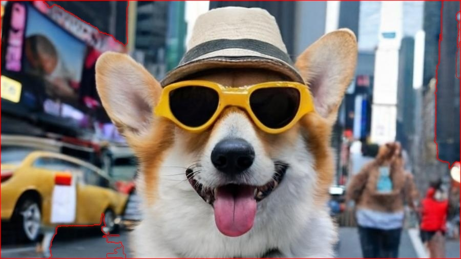

# 🖼️ Processamento de Imagens com OpenCV

Projeto desenvolvido utilizando **Python** e **OpenCV** para aplicar técnicas de processamento de imagens, como filtros, transformações e manipulações visuais.

## 📌 Sobre o projeto

Este projeto reúne diferentes scripts que resolvem questões práticas envolvendo processamento de imagens digitais, como parte de uma atividade acadêmica.

## ⚙️ Funcionalidades

- 📷 Leitura e exibição de imagens
- 🎨 Aplicação de filtros (blur, grayscale, etc.)
- 🔄 Transformações de imagem
- 🧠 Processamento de múltiplas questões

## 🛠️ Tecnologias utilizadas

- Python
- OpenCV
- NumPy

## 📸 Exemplo de Resultado

### Segmentação com Watershed

Imagem com o resultado do processamento:

## 📂 Estrutura do projeto

src/ # Scripts principais
img/ # Imagens utilizadas

## 🚀 Como executar

1. Clone o repositório:

https://github.com/luisfrancisco2b/Trabalho-5

2. Acesse a pasta do projeto:

cd nome-do-projeto

3. Instale as dependências:

pip install -r requirements.txt

4. Execute um dos scripts:

python src/questao1e2.py